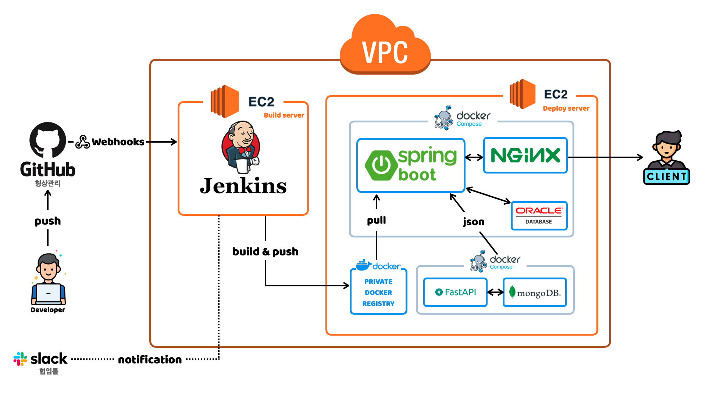
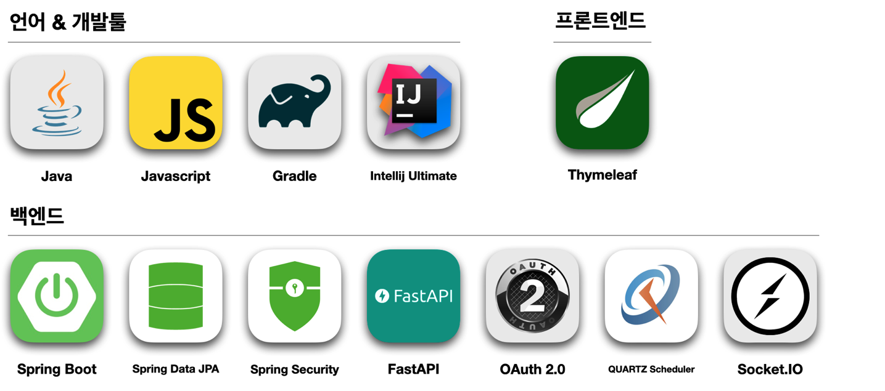
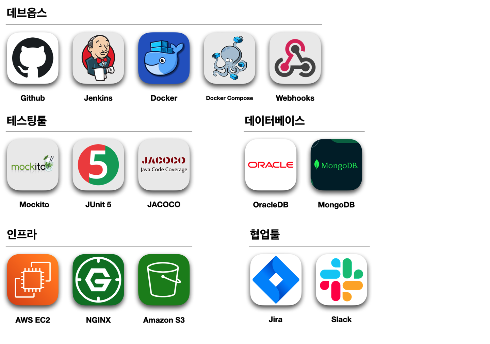
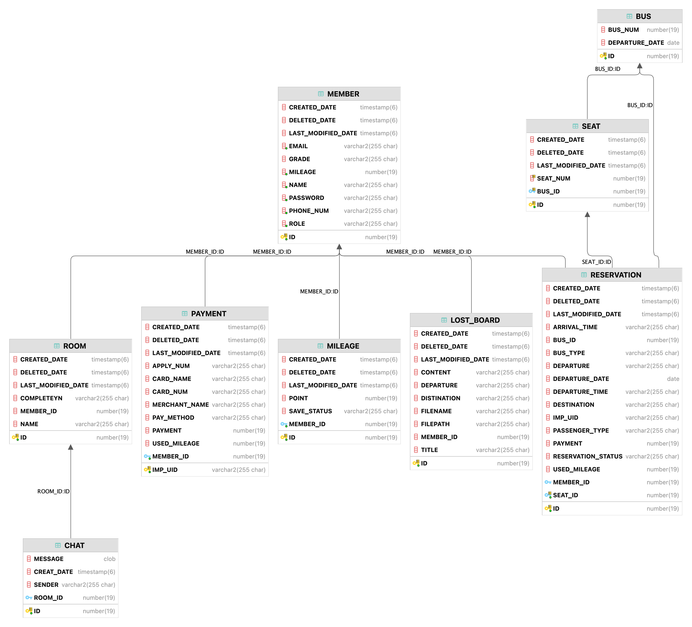
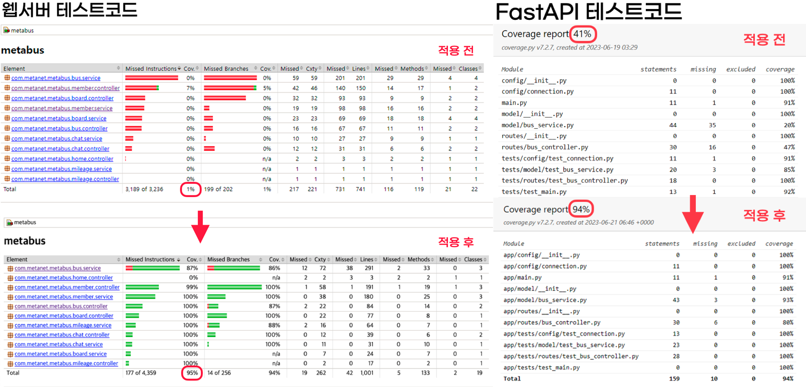

    

<h1> 🚌 Meta Bus[메타: 버스] </h1>
<h3> 시외버스 예약/구매/발권 서비스 </h3>

 

## 📌 배포
- [홈페이지](https://www.metabus.site/)
- [FastAPI Server](http://43.201.165.100:8888/docs#/)

 

## 📝 프로젝트 소개

### 개발 환경
- 에디터 : Intellij Ultimate, VScode
- 개발 툴 : SpringBoot 2.7.11
- 자바 : JAVA 11
- 빌드 : Gradle 7.6.1, Apache Tomcat 9.0.74
- 서버 : AWS EC2
- 배포 : Docker
- 데이터베이스 : Oracle-XE-11g, MongoDB 5.0.15
- 그 외 라이브러리 : Jacoco 0.8.8, Stomp-websocket 2.3.3, Sockjs-client 1.0.2 ...
  
 

### 🧱 Architecture

 

### ⚒️ 기술 스택

 

### 📍 ERD

 

## 📌 필수 요구사항
1. 반응형 화면 구현
   - 모든 페이지에 반응형을 적용하였고 이를 웹앱으로까지 확장시켰습니다.
2. aop를 활용해서 메서드 접근 로그 남기기
   - 여러 계층에서 공통된 로직인 메서드 접근 로그를 AOP를 이용해 한곳에서 정의했습니다.
3. quartz Scheduler를 이용한 배치 프로그램 기능 구현
   - 1분마다 돌며 예약한 지 10분이 지난 예약을 삭제하는 스케줄러를 구현했습니다.
   - 매일 자정에 돌며 출발일이 지난 티켓을 만료시키고 해당 티켓에 대해 마일리지를 적립해 주는 스케줄러를 구현했습니다.
4. 권한 처리
   - 각 회원마다 USER/GUEST/ADMIN의 역할이 부여되도록 구현했습니다.
   - 로그인하지 않은 사용자가 인증이 필요한 페이지에 접근하는 경우 로그인 페이지로 redirect 되도록 구현했습니다.
   - 관리자가 아닌 로그인된 일반 유저가 관리자 페이지에 접근하는 경우 에러 페이지로 redirect 되도록 구현했습니다.
5. 파일 첨부 기능 구현
   - 분실물 게시판에 분실물 사진을 업로드할 수 있도록 구현했습니다.
6. Transaction 처리 (@Transacitonal 사용)
   - 회원 가입과 같은 동시성 문제가 발생 할만한 부분에 @Transactional 어노테이션을 달아 트랜잭션을 관리했습니다
   - 시외버스 예약 정보를 저장할 때 모든 과정이 정상적일 때만 예약이 저장되어야 하므로 @Transactional 어노테이션을 달아 트랜잭션을 관리했습니다.
7. 프런트엔드에서 XHR(XML Http Request) 사용
   - Ajax를 사용해 웹 페이지 전체를 다시 로딩하지 않고도, 웹 페이지의 일부분만을 갱신할 수 있도록 구현했습니다.
8. 테스트 코드 커버리지 결과를 확인
   - Spring boot: jacoco를 이용해 코드 커버리지를 체크할 수 있도록 했습니다.
   - FastAPI: pytest한 결과를 coverage 패키지를 사용해 체크할 수 있도록 했습니다.
   

 

## 🚌 메타버스 서비스 소개

### 사용자 서비스
1. 회원 가입
   - 일반 회원가입의 경우 이메일과 Validation 체크를 통해 데이터의 신뢰성을 높였습니다.
   - OAuth2를 지원하여 편의성을 높였습니다.
   - 비밀번호 암호화를 통해 보안성을 높였습니다.
2. 로그인
   - 일반 로그인과 OAuth2 로그인을 지원하며 세션과 Spring Security를 이용해 구현했습니다.
3. 마이페이지
   - 인증된 유저(user, guest)만 접근할 수 있도록 구현했습니다.
   - 회원등급, 마일리지 / 승차권 페이지로 이동, 회원정보를 확인 할 수 있도록 구현했습니다.
   - 정보 수정 / 비밀번호 변경 / 탈퇴의 경우 비밀번호 재확인을 해야 접근할 수 있도록 구현했습니다.
4. 관리자 페이지
   - 인증된 유저(admin)만 접근할 수 있도록 구현했습니다.
   - 승차권 예약 / 예매현황, 실시간 인기 노선, 사용자 가입 현황을 확인 할 수 있도록 구현했습니다.

### 주요 서비스
1. 시외버스
   1. 시외버스 예약
      - 로그인한 유저가 좌석과 탑승인원을 선택해 시외버스를 예약할 수 있도록 구현했습니다.
      - 예약은 10분간 유지되며 1분마다 도는 Quartz Scheduler를 이용하여 삭제되도록 구현했습니다.
   2. 시외버스 조회
      - 출발지, 도착지, 출발일을 선택해서 시외버스 시간표를 조회할 수 있도록 구현했습니다.
   3. 시외버스 구매
      - 로그인한 유저가 같은 출발지, 도착지, 출발일을 가진 버스에 한해 합결제를 할 수 있도록 구현했습니다.
      - 결제를 마친 탑승권에 한해 승차권과 영수증을 확인할 수 있도록 구현했습니다.
   4. 시외버스 환불
      - 같은 주문번호를 가진(= 합결제를 한) 결제에 한해 부분취소가 가능하도록 구현했습니다.
2. 마일리지
   1. 마일리지 적립
      - 매일 정오에 도는 Quartz Scheduler를 이용하여 만료된 티켓에 대한 마일리지가 적립되도록 구현했습니다.
   2. 마일리지 사용
      - 결제 화면에서 마일리지 사용 조건에 충족될 시 마일리지 사용이 가능하도록 구현했습니다.
      - 마일리지 사용 조건:
         - 최소 10,000원이 넘는 거래에 한함
         - 마일리지는 1,000원 단위로 사용
         - 거래의 최대 90%까지만 마일리지 사용 가능
   3. 마일리지 취소
      - 결제 취소를 하면 즉시 사용한 마일리지가 환불됩니다.

### 부가 서비스
1. 분실물 게시판
   - 게시판에서 업로드된 이미지가 S3에 올라가게 해 서버 부담을 줄이도록 구현하였습니다
   - 인증된 유저(user, guest)만 접근할 수 있도록 구현했습니다.
   - 일반 사용자가 분실물 내역을 확인할 수 있도록 구현했습니다
   - 관리자 사용자가 분실물 게시글 생성/삭제 할 수 있도록 구현했습니다
2. 1:1문의 (실시간 채팅)
   - WebSocket을 이용해 외부 서버를 통신하지 않고 자체적으로 실시간 통신이 가능하게 했습니다
   - Spring 에서 지원하는 메세지 기반 프로토콜 Stomp을 사용해 메세지 교환을 가능하게 했습니다
   - 인증된 유저(user, guest)만 접근할 수 있도록 구현했습니다.
   - 관리자 사용자가 접근시 유저들의 채팅방 목록이 뜨게 구현했습니

 

## 🙋🏻‍♂️🙋🏻‍♀️ 팀원 소개

|              PL, Infra, Frontend              |                    Backend                     |                Infra, Backend                 |                 PM, Backend                  |                     Planner                     |
|:-------------------------------------------:|:----------------------------------------------:|:---------------------------------------------:|:--------------------------------------------:|:-----------------------------------------------:|
|  |  |  |  |  |
|     [👑정봉경](https://github.com/bong44)      |      [김건빈](https://github.com/kimgunbin)       |      [이연재](https://github.com/yjyj1023)       |      [장서현](https://github.com/Senna97)       |      [팜튀안](https://github.com/Anna112396)       |