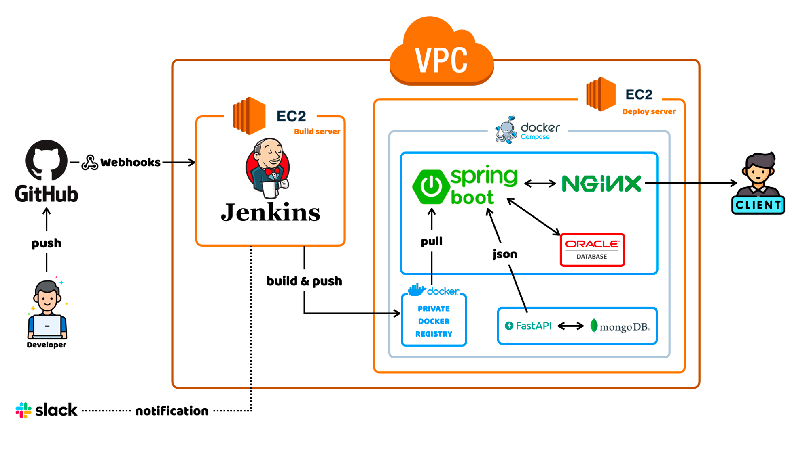
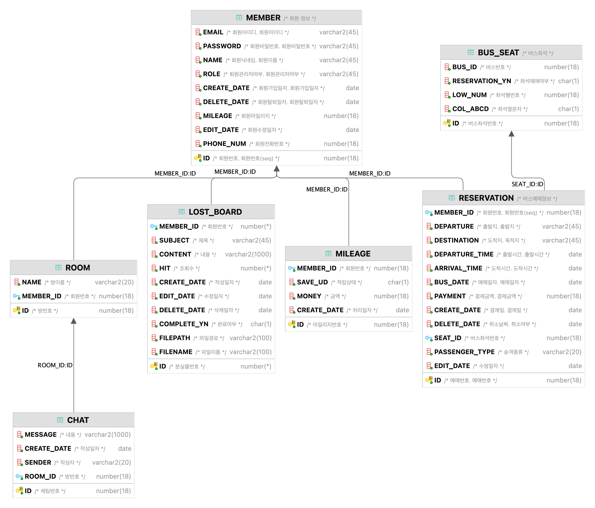

    

<h1> 🚌 Meta Bus[메타: 버스] </h1>
<h3> </h3>

 

 

## 📌 배포
- [홈페이지](http://www.metabus.site/)

 

## 📝 프로젝트 소개
### ⚒️ 기술 스택

 

### 🧱 Architecture

 

### 📍 ERD

 

## 🙋🏻‍♂️🙋🏻‍♀️ 팀원 소개

|             PL, Infra, Backend              |             Code Reviewer, Backend             |                Infra, Backend                 |                 PM, Backend                  |                     Planner                     |
|:-------------------------------------------:|:----------------------------------------------:|:---------------------------------------------:|:--------------------------------------------:|:-----------------------------------------------:|
|  |  |  |  |  |
|     [👑정봉경](https://github.com/bong44)      |      [김건빈](https://github.com/kimgunbin)       |      [이연재](https://github.com/yjyj1023)       |      [장서현](https://github.com/Senna97)       |      [팜튀안](https://github.com/Anna112396)       |